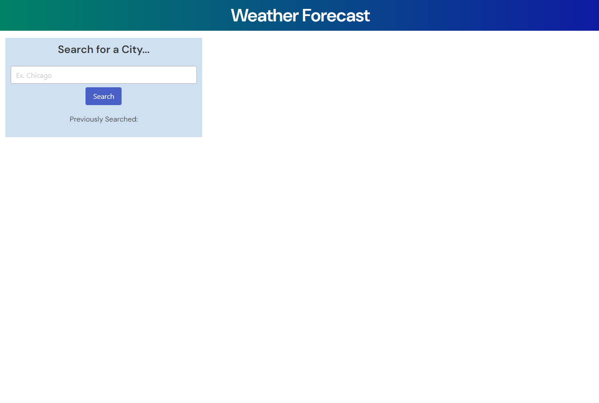
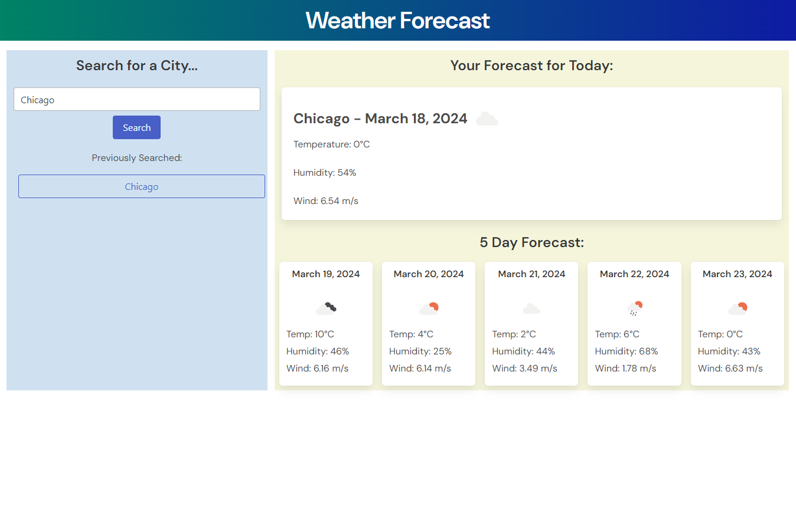

# Weather Dashboard

## Description

Knowing what the weather conditions will be like in your area goes a long way to make sure you're comfortable and prepared to take on your day (or week)! How frustrating is it when you're wrapped up with taking care of various tasks, errands, and plans, and then you're hit with an unexpected rainstorm? To help people stay "in the know" of weather conditions in various cities, I've created this simple, but effective, 5 Day Weather Forecast Dashboard.

This page utilizes an API from Open Weather that returns a detailed list of weather conditions for a certain location over the course of 5 days. For this application, I've simplified that data to temperature, wind speed, and humidity. Users can type in any city around the world, and the API will provide the weather conditions.

One challenge while completing this project was having to request data from one API to then immediately use as a parameter for another API: turning a search inquiry for a city name into latitude/longitude information for use in the main weather API. In addition to learning a workflow for this, I also opted to not use Bootstrap as a CSS framework, and chose to learn a new one: Bulma. This project involved a lot of reading documentation!

## Usage

To use the Weather Dashboard, please go to https://ajprobel.github.io/weather-dashboard/

Enter any city name into the search field, and watch the weather data appear!

Weather data includes an icon representing the overall weather, temperature data in Celsius, humidity, and wind speed in meters/second. You can see today's weather, as well as an overview for the next 5 days.

Previous searches are saved in a list underneath the search bar. Coming for patch 1 - clicking the past searches will update the info on screen!

## Credits

Website designed by me, James Probel, with guidelines given by the UNC Chapel Hill Programming Bootcamp

Thanks to Bulma for documenting guidelines on their CSS framework:
https://bulma.io/documentation/overview/

Thanks to OpenWeather for creating the main API used in this project:
https://openweathermap.org/forecast5#list

## License

See attached MIT license in project repository
